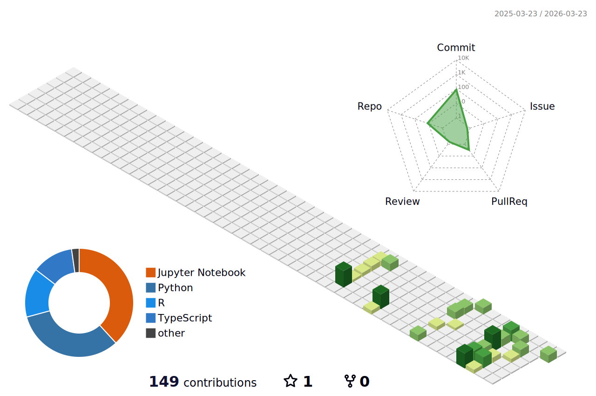

  

  &nbsp;
  &nbsp;
  &nbsp;
  

  

 

I build end-to-end ML systems - from raw data pipelines and model training to deployed APIs and dashboards. 
My work sits at the intersection of <strong>data, finance, and sports</strong>. Currently completing my MS in Data Science at UConn. 
Previously built backend systems and led a full Data Warehouse implementation at <strong>Garanti BBVA Teknoloji</strong>.

---

## 3D Contribution Calendar

  

> _Rendered by the [profile-3d-contrib](https://github.com/yoshi389111/github-profile-3d-contrib) action. Updates daily._

---

## GitHub Stats

  
  &nbsp;&nbsp;
  

  

---

## Activity

  

---

## Contribution Snake

  

> _Generated by the [snk](https://github.com/Platane/snk) action. Updates daily._

---

## Tech Stack

<strong>Languages</strong>

  
  
  
  
  

<strong>Data Science & ML</strong>

  
  
  
  
  
  
  
  
  

<strong>Web & Backend</strong>

  
  
  
  
  

<strong>DevOps & Cloud</strong>

  
  
  
  

---

## Featured Projects

| Project | What it does | Highlights |
|---|---|---|
| [Stock Signal Engine](https://github.com/EgeDenizPekel/stock-signal-engine) | End-to-end stock signal system: 27 engineered features, 4 model families, FastAPI on AWS, React dashboard on Vercel | LSTM Sharpe 1.23 on 2024 test data · 20 integration tests |
| [NBA Match Outcome Predictor](https://github.com/EgeDenizPekel/nba-predictor) | 22,796 games across 19 seasons, leakage-free rolling features, SHAP explainability, React dashboard | Val AUC 0.70 - near sportsbook ceiling · Brier-based model selection |
| [NBA Press Conference Sentiment](https://github.com/EgeDenizPekel/press-conference-sentiment-analyzer) | Fine-tuned RoBERTa on 23K sports press conference turns for coach/player sentiment classification | 92% accuracy vs 54% baseline · Published to Hugging Face Hub |
| [Transaction Anomaly Explainer](https://github.com/EgeDenizPekel/transaction-anomaly-explainer) | Fraud detection with SHAP-grounded LLM explanations, Evidently drift monitor, Celery retraining pipeline | LLM faithfulness 97% (constrained) · F1 recovery after drift in <10 min |
| [Repo Onboarding Agent](https://github.com/EgeDenizPekel/repo-onboarding-agent) | LangGraph agent that autonomously explores any GitHub repo, self-scores understanding, validates file refs deterministically | Fine-tuned Qwen2.5-7B · 96.6% file ref accuracy · $0.04/guide |

---

## Experience

**Garanti BBVA Teknoloji** - Software Engineer &nbsp;`Jan 2023 - Jul 2025`
- Real-time crypto trade monitoring dashboard via Spring Boot APIs (12-person team)
- Led full Data Warehouse migration: 60+ production tables, 100K+ rows/day ingestion pipeline
- SQL workshops for the Finance team enabling daily reports to senior management

**Cubtale** - Mobile Application Developer &nbsp;`Sep 2021 - Jun 2022`
- Cross-platform features in Flutter for an AI-driven baby care app

**Peak Games** - Software Engineer Intern &nbsp;`Jul 2020 - Sep 2020`
- Configurable puzzle game in Unity/C# for an internal game jam

---

## Education

**MS Data Science** · University of Connecticut &nbsp;`2025 - 2026` &nbsp;· GPA 3.88

**BS Computer Science & Engineering** · Sabancı University &nbsp;`2017 - 2021`

---

  

